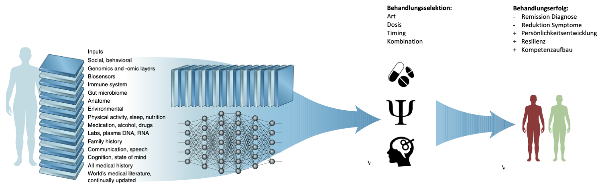
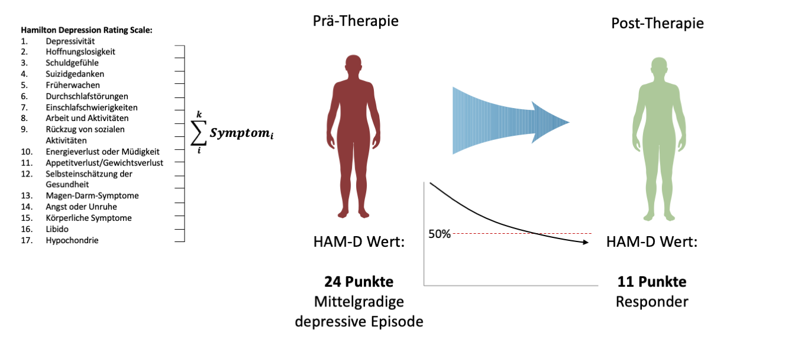
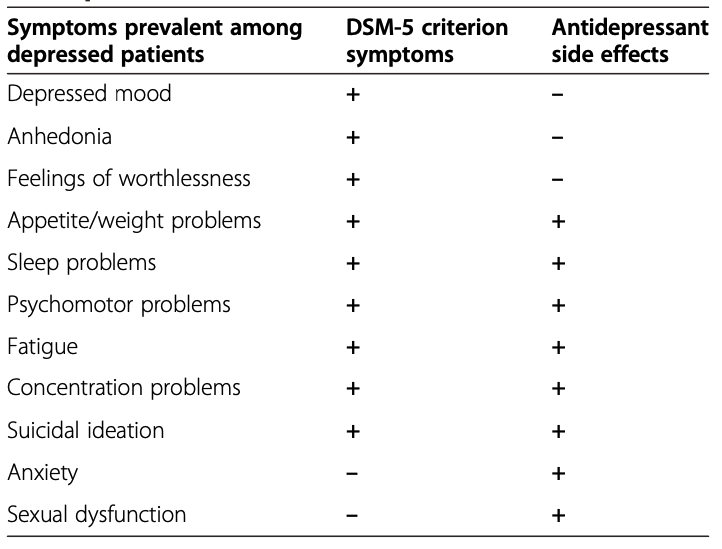
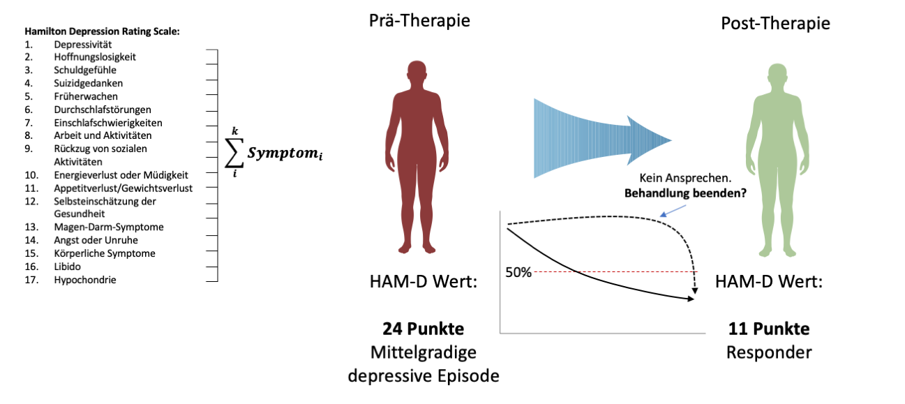
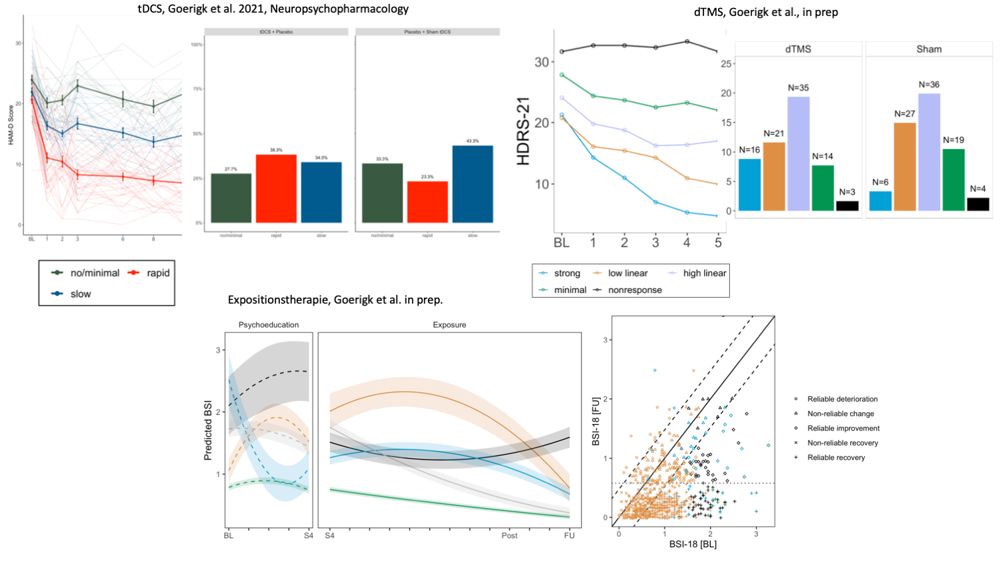

```{r setup, include=FALSE}
options(htmltools.dir.version = FALSE)

setwd("/Users/stephangoerigk/Desktop/Universität/CFH/Lehre/Bachelor/Quantitative Methoden I/VO_Statistik I/Statistik_I_Folien_SS23/Statistik_I_Folien_SS23/")

library(tidyverse)
library(kableExtra)
library(ggplot2)
library(plotly)
library(htmlwidgets)
library(MASS)
library(ggpubr)
library(xaringanthemer)
library(xaringanExtra)

style_duo_accent(
  primary_color = "#621C37",
  secondary_color = "#EE0071",
  background_image = "blank.png"
)

xaringanExtra::use_xaringan_extra(c("tile_view"))

use_scribble(
  pen_color = "#EE0071",
  pen_size = 4
  )

knitr::opts_chunk$set(
  fig.retina = TRUE,
  warning = FALSE,
  message = FALSE
)
```

name: Title slide
class: middle, left
<br><br><br><br><br><br><br>

## Antrittsvorlesung

#### Komplexe Modellierung Klinischer Behandlungsdaten im Kontext Psychischer Gesundheit

#### Analyseansätze zur Erhöhung der Passung von Behandlung und Patient:in

##### 17.11.2023 | Prof. Dr. phil. Stephan A. Goerigk

---
class: top, left
name: Contact Slide

### Kontakt

.pull-left[
Prof. Dr. phil. Stephan Goerigk 

Lehrstuhl Psychologische Methodenlehre

Infanteriestraße 11a · 80797 München · 

[stephan.goerigk@charlotte-fresenius-uni.de](mailto:stephan.goerigk@charlotte-fresenius-uni.de)

***

[Publikationen](https://scholar.google.at/citations?user=nlvO-e4AAAAJ&hl=de)

[Commitment to Research Transparency](http://www.researchtransparency.org)
]

.pull-right[
.center[
<br><br><br>
.bottom[]
]
]

---
class: top, left
### Erhöhung der Passung von Behandlung und Patient:in

#### Bedarfsklärung - Status quo

* Psychische Störungen: ~26% Lebenszeitprävalenz weltweit

* Große Lücke zwischen Behandlungsbedarf und -angebot

* Weitaus seltener behandelt als körperliche Erkrankungen (Clark, 2018)

**Hürden:**

* Verfügbarkeit

* Stigma - Person, die sich Hilfe sucht, ist ein Glücksfall

**Therapieansprechen:**

* 60% sprechen entweder nicht auf Behandlung an oder werden innerhalb eines Jahres rückfällig (Layard & Clark, 2015)

* Gute Kurzzeitergebnisse sind keine Garantie für gute Langzeitergebnisse


---
class: top, left
### Erhöhung der Passung von Behandlung und Patient:in

#### One-size-fits-all Psychiatrie

.center[
##### *Leitsatz:* Heuristik $\rightarrow$ Monitoring $\rightarrow$ Adaption nach dem Prinzip von Versuch & Irrtum.

```{r eval = TRUE, echo = F, out.width = "800px"}

```
]

---
class: top, left
### Erhöhung der Passung von Behandlung und Patient:in

<small>

#### Maßgeschneiderte Behandlungen - Präzisionspsychiatrie

.center[

##### *Leitsatz:* Die richtige Behandlung mit individualisierter Dosis zum passenden Zeitpunkt.

```{r eval = TRUE, echo = F, out.width = "1200px"}

```
]

.right[
Topol et al. 2020
]


---
class: top, left
### Erhöhung der Passung von Behandlung und Patient:in

<small>

#### Präzisionspsychiatrie - Problem der Zieldefinition (Targets)

.center[

##### *Leitsatz:* Die richtige Behandlung mit individualisierter Dosis zum passenden Zeitpunkt.

```{r eval = TRUE, echo = F, out.width = "1200px"}

```
]

.right[
Topol et al. 2020
]

---
class: top, left
### Präzisionspsychiatrie - Problem der Zieldefinition (Targets)

#### Target 1: Remission der Diagnose (ICD-10/11; DSM-5)

.center[
```{r eval = TRUE, echo = F, out.width = "500px"}

```
]

---
class: top, left
### Präzisionspsychiatrie - Problem der Zieldefinition (Targets)

#### Therapieoptimierung zur Remission der Diagnose (ICD-10/11; DSM-5)

ABER: Aktuelle Diagnosen bilden die Realität unzureichend ab:

  * Heterogenität innerhalb Diagnosen (Hyman, 2021)
  
  * Komorbiditäten eher Regel als Ausnahme (ca. 50% haben >1 Diagnose; Sauer-Zavala et al., 2017)
  
  * Nicht trennscharf in der Symptomzuordnung (z.B. Depression vs. Generalisierte Angststörung)

.center[
```{r eval = TRUE, echo = F, out.width = "800px"}

```
]

---
class: top, left
### Präzisionspsychiatrie - Problem der Zieldefinition (Targets)

#### Diagnose vs. Transdiagnostische Prozesse

* Transdiagnostische Prozesse = Prozesse, die multiple oder komorbide Störungen verursachen/aufrechterhalten

* Symptome sind über Störungskategorien hinweg relevant

* Beispiele für transdiagnostische Prozesse:

>  * Stress
  
>  * Grübeln
  
>  * Schlafprobleme
  
>  * [...]

---
class: top, left
### Diagnose vs. Transdiagnostische Prozesse

<small>

#### Frühkindliches Trauma (ACE) als transdiagnostisches Merkmal (Goerigk et al. Psychiatry Research, 2023)

.pull-left[
.center[
```{r eval = TRUE, echo = F, out.width = "500px"}

```
]
]

.pull-right[
.center[

```{r eval = TRUE, echo = F, out.width = "250px"}

```

```{r eval = TRUE, echo = F, out.width = "250px"}

```
]
]

---
class: top, left
### Diagnose vs. Transdiagnostische Prozesse

#### Frühkindliches Trauma (ACE) als transdiagnostisches Merkmal (Goerigk et al. Psychiatry Research, 2023)

.pull-left[
.center[
```{r eval = TRUE, echo = F, out.width = "600px"}

```
]
* Frühkindliches Trauma liefert uns genauere Information über aktuelle Psychopathologie als Diagnose
]

.pull-right[
.center[

```{r eval = TRUE, echo = F, out.width = "450px"}

```
]
]

---
class: top, left
### Präzisionspsychiatrie - Problem der Zieldefinition (Targets)

#### Target 2: Reduktion des Symptomschweregrads (Summenscore Symptomcheckliste)

.center[
```{r eval = TRUE, echo = F, out.width = "1000px"}

```
]

---
class: top, left
### Differenziertere Targets - Symptomcluster

#### Berücksichtigung von Überdeckungseffekten

```{r eval=FALSE, include=FALSE}
# * Symptome gleichgewichtet summiert (𝝉-äquivalent)
#* Ignorieren symptomspezifischer Effekte.
```


.pull-left[
.pull-left[
.center[
```{r eval = TRUE, echo = F, out.width = "130px"}

```
]
.center[
```{r eval = TRUE, echo = F, out.width = "200px"}

```
]
]
.pull-right[
.center[
<br>
```{r eval = TRUE, echo = F, out.width = "800px"}
knitr::include_graphics("bilder/gif1.gif")
```
]
.center[
<br><br>
```{r eval = TRUE, echo = F, out.width = "800px"}

```
]
]
]

.pull-right[
.pull-left[
<small>
* Symptome gleichgewichtet summiert (𝝉-äquivalent)

* Ignorieren symptomspezifischer Effekte.
]
.pull-right[
.center[
```{r eval = TRUE, echo = F, out.width = "300px"}

```
]

```{r eval=FALSE, include=FALSE}
df = data.frame(Symptom = c("Gedrückte Stimmung",
                            "Anhedonie",
                            "Gefühle der Wertlosigkeit",
                            "Appteit-/Gewichtsprobleme",
                            "Schlafprobleme",
                            "Psychomotorik",
                            "Erschhöpfung",
                            "Konzentrationsschwierigkeiten",
                            "Suizidalität",
                            "Angst",
                            "Libido"),
                DSM = c("+",
                            "+",
                            "+",
                            "+",
                            "+",
                            "+",
                            "+",
                            "+",
                            "+",
                            "-",
                            "-"),
                AE = c("-",
                            "-",
                            "-",
                            "+",
                            "+",
                            "+",
                            "+",
                            "+",
                            "+",
                            "+",
                            "+"))
kable(df)
```

]
.center[
```{r eval = TRUE, echo = F, out.width = "400px"}
knitr::include_graphics("bilder/symptomcluster3.png")
```
]
]

---
class: top, left
### Differenziertere Targets - Symptomcluster 

#### Berücksichtigung von Überdeckungseffekten (Goerigk et al. Brain Stimulation, 2021)

.center[
```{r eval = TRUE, echo = F, out.width = "950px"}
knitr::include_graphics("bilder/Fig1.png")
```
]

---
class: top, left
### Präzisionspsychiatrie - Problem der Zieldefinition (Targets)

#### Target 2: Reduktion des Symptomschweregrads (Summenscore Symptomcheckliste)

.center[
```{r eval = TRUE, echo = F, out.width = "1000px"}

```
]


---
class: top, left
### Dynamische Targets - Response-Trajektorien

#### Berücksichtigung von Behandlungsdynamiken 

.pull-left[
.pull-left[
1-Trajektorien-Ansatz
.center[
```{r eval = TRUE, echo = F, out.width = "250px"}
knitr::include_graphics("bilder/gif4.gif")
```

***
]
Mixture-Modell
.center[
```{r eval = TRUE, echo = F, out.width = "250px"}
knitr::include_graphics("bilder/gif5.gif")
```
]
]

.pull-right[
Durchschnittstrajektorie
.center[
```{r eval = TRUE, echo = F, out.width = "250px"}
knitr::include_graphics("bilder/gif1.gif")
```

***
]
Durchschnittstrajektorien
.center[
```{r eval = TRUE, echo = F, out.width = "250px"}

```
]
]

]

.pull-left[
.pull-right[


* Ignoriert **frühes/spätes** Ansprechen

* Ignoriert individuelle **Dynamik** in Symptomveränderung

***

* Verhinderung verfrühter **Behandlungsabbrüche**

* **Adaption** von Behandlung möglich
]
]

---
class: top, left
### Dynamische Targets - Response-Trajektorien

#### Berücksichtigung von Behandlungsdynamiken 

.center[
```{r eval = TRUE, echo = F, out.width = "850px"}

```
]

---
class: top, left
### Komplexe Targets - Netzwerke

#### Systemtheorie: Einfache vs. komplexe Systeme

.pull-left[
.center[
```{r eval = TRUE, echo = F, out.width = "360px"}

```
]
]

.pull-right[
**Eigenschaften komplexer Systeme:**

* Können sich selbst stabil halten (Equilibrium)

* Elemente interagieren (Rückkopplung)

* Können sich graduell oder saltatorisch (Kipppunkt) ändern 

**Beispiele:**

> * Klima

> * Ökosysteme und Organismen

> * Städte

> * [...]

]

---
class: top, left
### Komplexe Targets - Netzwerke

.pull-left[
#### 1. Inaktives Netzwerk, stabiles Equilibrium

.center[
```{r eval = TRUE, echo = F, out.width = "2000px"}
knitr::include_graphics("bilder/netz1.png")
```
]


]
.pull-right[
.center[
```{r eval = TRUE, echo = F, out.width = "250px"}

```
]
]

---
class: top, left
### Komplexe Targets - Netzwerke

.pull-left[
#### 2. Netzwerk Aktivierung

.center[
```{r eval = TRUE, echo = F, out.width = "2000px"}

```
]
]

.pull-right[
.center[
```{r eval = TRUE, echo = F, out.width = "250px"}

```
]
]

---
class: top, left
### Komplexe Targets - Netzwerke

.pull-left[
#### 3. Symptomausbreitung

.center[
```{r eval = TRUE, echo = F, out.width = "2000px"}

```
]
]
.pull-right[
.center[
```{r eval = TRUE, echo = F, out.width = "250px"}
knitr::include_graphics("bilder/p3.gif")
```
]
]

---
class: top, left
### Komplexe Targets - Netzwerke

.pull-left[
#### 4. Erkranktes Netzwerk, stabiles Equilibrium

.center[
```{r eval = TRUE, echo = F, out.width = "2000px"}

```
]
]

.pull-right[
.center[
```{r eval = TRUE, echo = F, out.width = "250px"}

```
]
]

---
class: top, left
### Komplexe Targets - Netzwerke

#### Resiliente vs. vulnerable Systeme

.center[
```{r eval = TRUE, echo = F, out.width = "900px"}

```
]

---
class: top, left
### Komplexe Targets - Netzwerke

#### Behandlungsmodelle mit Kenntnis des Systemzustands

.center[
```{r eval = TRUE, echo = F, out.width = "870px"}

```
]

---
class: top, left
### Lehrstuhl für Psych. Methoden - Lehre

.center[
<iframe width="840" height="472.5" src="https://daze02-stephan-goerigk.shinyapps.io/Statistik_trainer/"></iframe>
]

---
class: top, left
### Lehrstuhl für Psych. Methoden - Lehre

.center[
<iframe width="840" height="472.5" src="https://stephangoerigk.github.io/CFH_R_bookdown/über-dieses-skript.html"></iframe>
]

---
class: top, left
### Lehrstuhl für Psych. Methoden - Lehre

.center[
<iframe width="840" height="472.5" src="https://daze02-stephan-goerigk.shinyapps.io/Uebung1k/"></iframe>
]

---
class: top, left
### Lehrstuhl für Psych. Methoden

#### Forschungs AG 

.center[
```{r eval = TRUE, echo = F, out.width = "870px"}

```
]


---
class: top, left
### Take-aways

.full-width[.content-box-gray[

* **Präzisionspsychiatrie** statt **One-size-fits all**

* Fortschritte in Datenerhebung und Modellierung, aber **unscharfe Targets**

* Diagnosen bilden klinische Realität teils nicht ab $\rightarrow$ **Transdiagnostik**

* Symptom-Summenwerte zu undifferenziert $\rightarrow$ **Symptomcluster**

* Responder-Status am Therapieende hat unzureichende zeitliche Auflösung $\rightarrow$ **Response-Trajektorien**

* Orthogonale Modellierung ist unterkomplex $\rightarrow$ **multivariate (Netzwerk)modelle**

]

]


